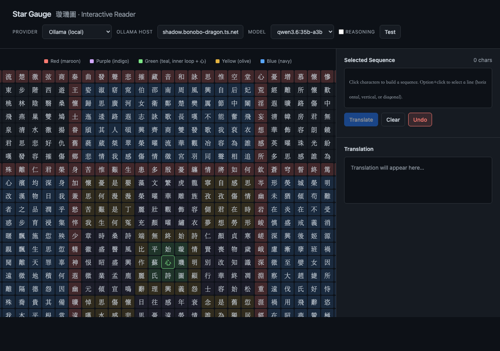

# Star Gauge 璇璣圖 — Interactive Reader

An interactive web reader for Su Hui's 4th-century *Star Gauge* (璇璣圖), a remarkable palindrome poem composed as a 29×29 grid of Chinese characters.



## About the Poem

The Star Gauge was written by Su Hui during the Former Qin dynasty as a letter to her exiled husband. The 841-character grid can be read in multiple directions — horizontally, vertically, diagonally — yielding roughly 3,000 smaller rhyming poems. The outer border forms a single circular poem, thought to be both the first and the longest of its kind.

## Features

- **Interactive Grid** — Click characters to build reading sequences; Option/Alt+click (or Shift+click) to select entire lines in any direction
- **AI Translation** — Send selected sequences to a local Ollama model or OpenRouter for classical Chinese translation
- **Colour-Coded Zones** — Characters are shaded by their ring colour: red, purple, green (inner loop + centre), yellow, and blue
- **Keyboard Shortcuts** — `Esc` to clear, `Ctrl+Enter` to translate, `Ctrl+Z` to undo

## Quick Start

```bash
./serve.sh
```

Then open http://127.0.0.1:8080

Requires a local Ollama server (set `OLLAMA_HOST=0.0.0.0`) or an OpenRouter API key for translation features.

## Credits

- Poem text sourced from [Wikipedia: Star Gauge](https://en.wikipedia.org/wiki/Star_Gauge)
- Original poem by Su Hui (蘇蕙), c. 4th century CE

## License

MIT License — see [LICENSE](LICENSE)
